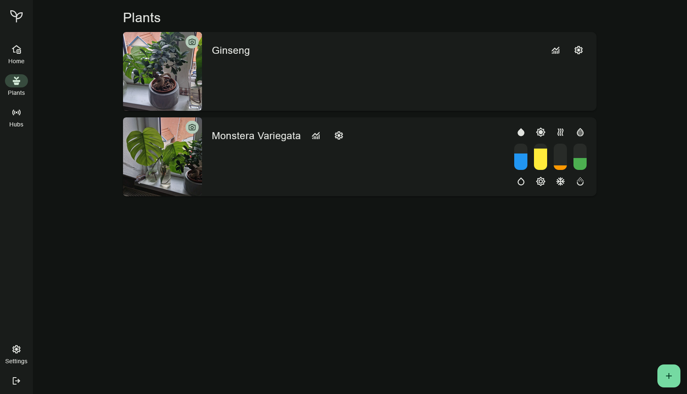
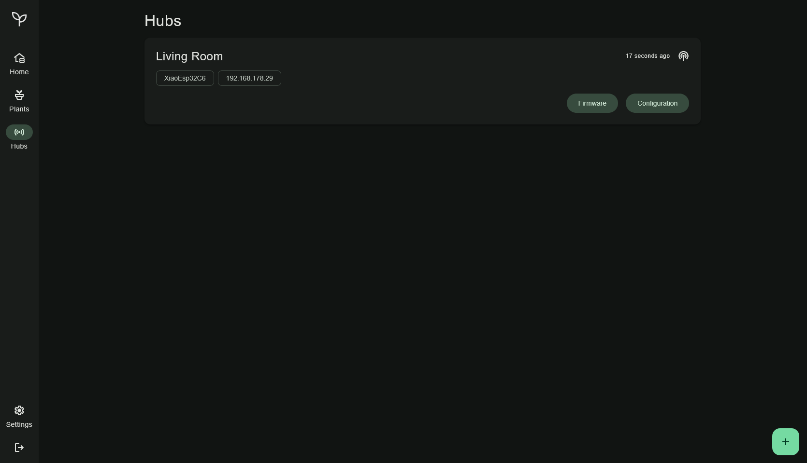

# greenguard

greenguard is a stand-alone plant monitoring system. It was born from the idea of being a lightweight alternative to plant monitoring integrations in Home Assistant.

It has a minimalist user interface, multi-user management and, in addition to automatic monitoring, manual tracking of watering and fertilising behaviour.

## Features

- **Multi-user**: Supports multiple users with individual plants.
- **Manual tracking**: Allows manual tracking of watering and fertilising.
- **Automatic monitoring**: Monitors plants automatically using MiBeacon and BTHome (needs a configured hub).
- **Restful-API**: Provides a REST API for easy integration with other systems.

## Screenshots

## License

greenguard is licensed under the MIT License. See the [LICENSE](LICENSE) file for more details.